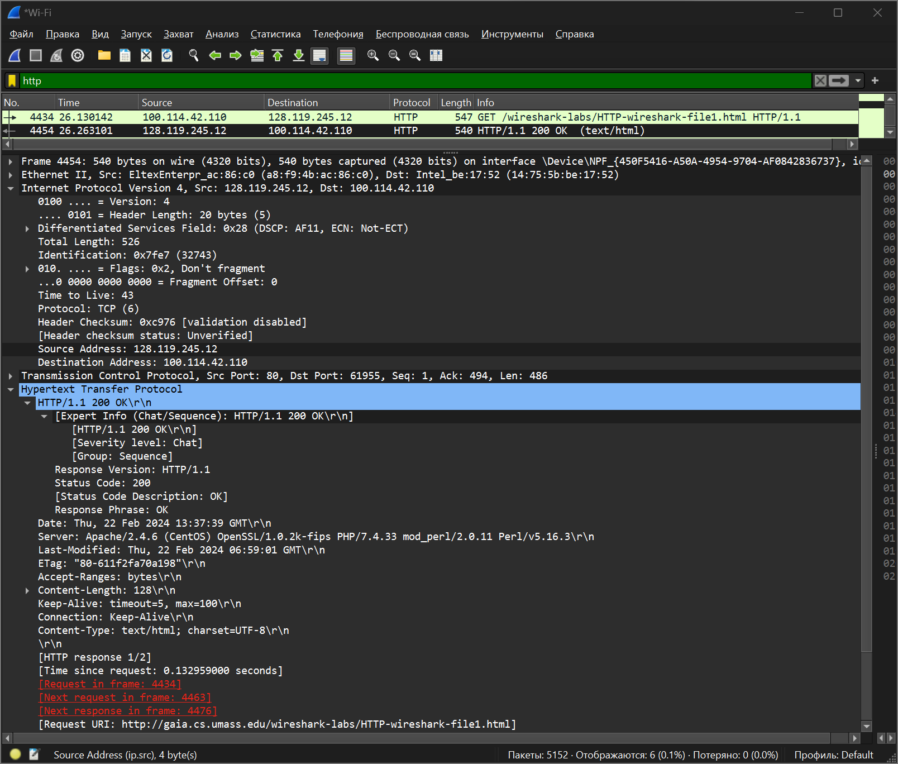
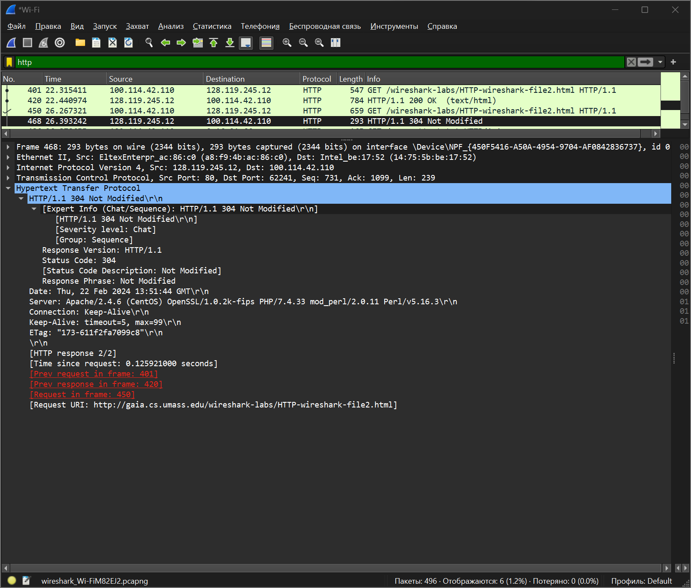
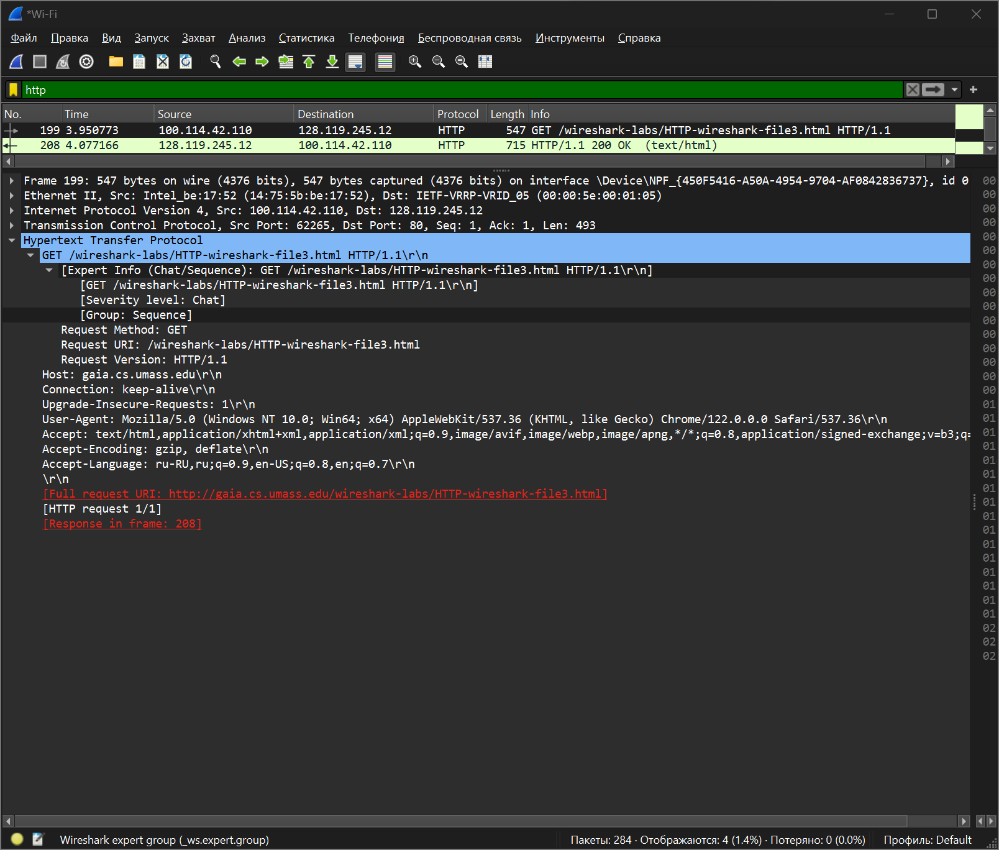
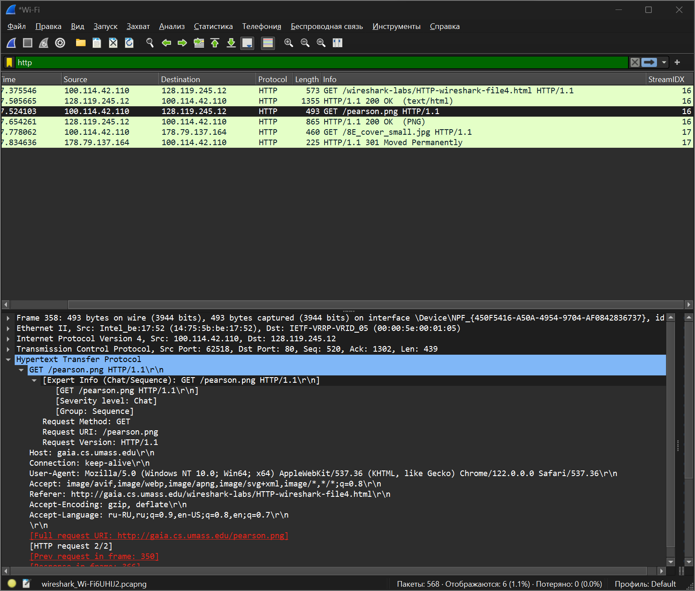
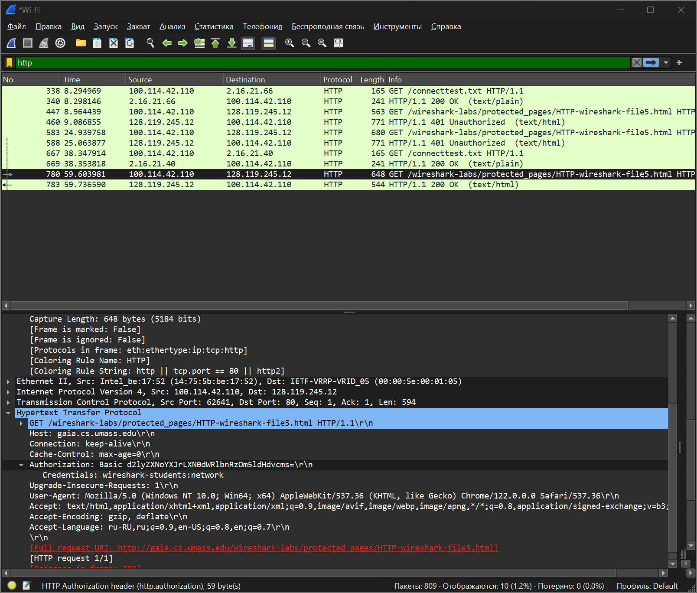

# Практика 1. Wireshark: HTTP
Эта работа исследует несколько аспектов протокола HTTP: базовое взаимодействие GET/ответ,
форматы сообщений HTTP, получение больших файлов HTML, получение файлов HTML со
встроенными объектами, а также проверку подлинности и безопасность HTTP.

Во всех заданиях (а также во всех следующих лабах) предполагается, что вы к своему ответу 
приложите **подтверждающий скрин** программы Wireshark (достаточно одного скрина на задание).

## Задание 1. Базовое взаимодействие HTTP GET/response (2 балла)

#### Подготовка
1. Запустите веб-браузер.
2. Запустите анализатор пакетов Wireshark, но пока не начинайте захват пакетов. Введите
   «http» в окне фильтра, чтобы позже в окне списка пакетов отображались только захваченные сообщения HTTP.
3. Подождите несколько секунд, а затем начните захват пакетов Wireshark.
4. Введите в браузере адрес: http://gaia.cs.umass.edu/wireshark-labs/HTTP-wireshark-file1.html.  
   Ваш браузер должен отобразить очень простой однострочный HTML-файл.
5. Остановите захват пакетов Wireshark.

#### Вопросы

1. Использует ли ваш браузер HTTP версии 1.0 или 1.1? Какая версия HTTP работает на
   сервере?
   - Мой браузер использует HTTP/1.1 (поле `Request version: HTTP/1.1`)
   - На сервере тоже HTTP/1.1 (поле `Response version: HTTP/1.1`)

2. Какие языки (если есть) ваш браузер может принимать? В захваченном сеансе какую еще
   информацию (если есть) браузер предоставляет серверу относительно пользователя/браузера?
   - Судя по полю в запросе, приинимаемые языки: `Accept-Language: en-US,en;q=0.9\r\n`, 
   - Дополнительная информация, предоставляемая серверу: `User-Agent: Mozilla/5.0 (Windows NT 10.0; Win64; x64) AppleWebKit/537.36 (KHTML, like Gecko) Chrome/121.0.0.0 Safari/537.36 Edg/121.0.0.0\r\n`

3. Какой IP-адрес вашего компьютера? Какой адрес сервера gaia.cs.umass.edu?
   -  `Internet Protocol Version 4, Src: 100.114.42.110, Dst: 128.119.245.12`, где `Src` - локальный IP моего компьютера, а `Dst` - IP адрес сервера
   - Более того, есть поля `Source Address: 100.114.42.110` и `Destination Address: 128.119.245.12` соответственно

4. Какой код состояния возвращается с сервера на ваш браузер?
   - `Status Code: 200`

5. Когда HTML-файл, который вы извлекаете, последний раз модифицировался на сервере?
   - `Last-Modified: Thu, 22 Feb 2024 06:59:01 GMT\r\n`

6. Сколько байтов контента возвращается вашему браузеру?
   - `Content-Length: 128\r\n`



## Задание 2. HTTP CONDITIONAL GET/response (2 балла)
Большинство веб-браузеров выполняют кэширование объектов и, таким образом, выполняют
условный GET при извлечении объекта HTTP. Прежде чем выполнять описанные ниже шаги, 
убедитесь, что кеш вашего браузера пуст.

#### Подготовка
1. Запустите веб-браузер и убедитесь, что кэш браузера очищен.
2. Запустите анализатор пакетов Wireshark.
3. Введите следующий URL-адрес в адресную строку браузера:
   http://gaia.cs.umass.edu/wireshark-labs/HTTP-wireshark-file2.html.  
   Ваш браузер должен отобразить очень простой пятистрочный HTML-файл.
4. Введите тот же URL-адрес в браузер еще раз (или просто нажмите кнопку обновления в
   браузере).
5. Остановите захват пакетов Wireshark и введите «http» в окне фильтра, чтобы в окне списка
   пакетов отображались только захваченные HTTP-сообщения.

#### Вопросы
1. Проверьте содержимое первого HTTP-запроса GET. Видите ли вы строку «IF-MODIFIED-SINCE» в HTTP GET?
   - В первом запросе такой строки нет
2. Проверьте содержимое ответа сервера. Вернул ли сервер содержимое файла явно? Как вы
   это можете увидеть?
   - Сервер явно вернул содержимое файла (`200 OK`), можно посмотреть
      ``` text
      Line-based text data: text/html (10 lines)
         
         <html>
         Congratulations again!  Now you've downloaded the file lab2-2.html. <br>
         This file's last modification date will not change.  <p>
         Thus if you download this multiple times on your browser, a complete copy <br>
         will only be sent once by the server due to the inclusion of the IN-MODIFIED-SINCE<br>
         field in your browser's HTTP GET request to the server.
         </html>
      ```
3. Теперь проверьте содержимое второго HTTP-запроса GET (из вашего браузера на сторону
   сервера). Видите ли вы строку «IF-MODIFIED-SINCE» в HTTP GET? Если да, то какая
   информация следует за заголовком «IF-MODIFIED-SINCE»?
   - `If-Modified-Since: Thu, 22 Feb 2024 06:59:01 GMT\r\n`
4. Какой код состояния HTTP и фраза возвращаются сервером в ответ на этот второй запрос
   HTTP GET? Вернул ли сервер явно содержимое файла?
   - `[HTTP/1.1 304 Not Modified\r\n]`
   - Сервер содержимое файла не возвращает



## Задание 3. Получение длинных документов (2 балла)

#### Подготовка
1. Запустите веб-браузер и убедитесь, что кэш браузера очищен.
2. Запустите анализатор пакетов Wireshark.
3. Введите следующий URL-адрес в адресную строку браузера:
   http://gaia.cs.umass.edu/wireshark-labs/HTTP-wireshark-file3.html  
   В браузере должен отобразиться довольно длинный текст.
4. Остановите захват пакетов Wireshark и введите «http» в окне фильтра.

#### Вопросы
1. Сколько сообщений HTTP GET отправил ваш браузер? Какой номер пакета в трассировке
   содержит сообщение GET?
   - Браузер отправил одно сообщение GET
   - Пакет №199

2. Какой номер пакета в трассировке содержит код состояния и фразу, связанные с ответом
   на HTTP-запрос GET?
   - №208

3. Сколько сегментов TCP, содержащих данные, потребовалось для передачи одного HTTP ответа?
   - Потребовалось 2 сегмента: `[2 Reassembled TCP Segments (4861 bytes): #207(4200), #208(661)]`

4. Есть ли в передаваемых данных какая-либо информация заголовка HTTP, связанная с
   сегментацией TCP?
   - Только response code 200



## Задание 4. HTML-документы со встроенными объектами (2 балла)
Исследуйте, что происходит, когда ваш браузер загружает файл со встроенными объектами, т. е. файл, 
включающий в себя другие объекты (в данном примере это файлы и картинки),
которые хранятся на другом сервере (серверах).

#### Подготовка
1. Запустите веб-браузер и убедитесь, что кэш браузера очищен.
2. Запустите анализатор пакетов Wireshark.
3. Введите следующий URL-адрес в адресную строку браузера:
   http://gaia.cs.umass.edu/wireshark-labs/HTTP-wireshark-file4.html.  
   Ваш браузер должен отобразить HTML-файл с двумя изображениями. На эти два изображения есть ссылки в
   базовом файле HTML. То есть сами изображения не содержатся в HTML, вместо этого URL-
   адреса изображений содержатся в загруженном файле HTML. Ваш браузер должен
   получить эти изображения с указанных веб-сайтов.
4. Остановите захват пакетов Wireshark и введите «http» в окне фильтра.

#### Вопросы
1. Сколько HTTP GET запросов было отправлено вашим браузером? На какие интернет-адреса были отправлены эти GET-запросы?
   - Всего было 3 запроса
   - 2 запроса на адрес `128.119.245.12` (html файл + изображение), 1 запрос на `178.79.137.164` (изображение)

2. Можете ли вы сказать, загрузил ли ваш браузер два изображения последовательно или
   они были загружены с веб-сайтов параллельно? Объясните.
   - Скорее параллельно. Последняя колонка на скриншоте получена [отсюда](https://networkengineering.stackexchange.com/questions/52894/how-to-determine-whether-files-are-downloaded-serially-or-in-parallel-using-wire). Запросы выполняются в разных tcp потоках (хотя может быть, что два запроса окажутся в одном потоке) и на разных портах: `Transmission Control Protocol, Src Port: 62518, Dst Port: 80, Seq: 1, Ack: 1, Len: 519` и `Transmission Control Protocol, Src Port: 62519, Dst Port: 80, Seq: 1, Ack: 1, Len: 406`



## Задание 5. HTTP-аутентификация (2 балла)
Запустите веб-сайт, защищенный паролем, и исследуйте последовательность HTTP-сообщений, которыми обмениваются такие сайты.

#### Подготовка
1. Убедитесь, что кеш вашего браузера очищен.
2. Запустите анализатор пакетов Wireshark.
3. Введите следующий URL-адрес в адресную строку браузера:
   http://gaia.cs.umass.edu/wireshark-labs/protected_pages/HTTP-wireshark-file5.html
4. Введите требуемые имя пользователя и пароль во всплывающем окне  
   (Имя пользователя — «wireshark-students», пароль — «network»).
5. Остановите захват пакетов Wireshark и введите «http» в окне фильтра

#### Вопросы
1. Каков ответ сервера (код состояния и фраза) в ответ на начальное HTTP-сообщение GET от вашего браузера?
   - `HTTP/1.1 401 Unauthorized\r\n`

2. Когда ваш браузер отправляет сообщение HTTP GET во второй раз, какое новое поле включается в сообщение HTTP GET?
   - Authorization: d2lyZXNoYXJrLXN0dWRlbnRzOm5ldHdvcms=\r\n
   - Credentials: wireshark-students:network



