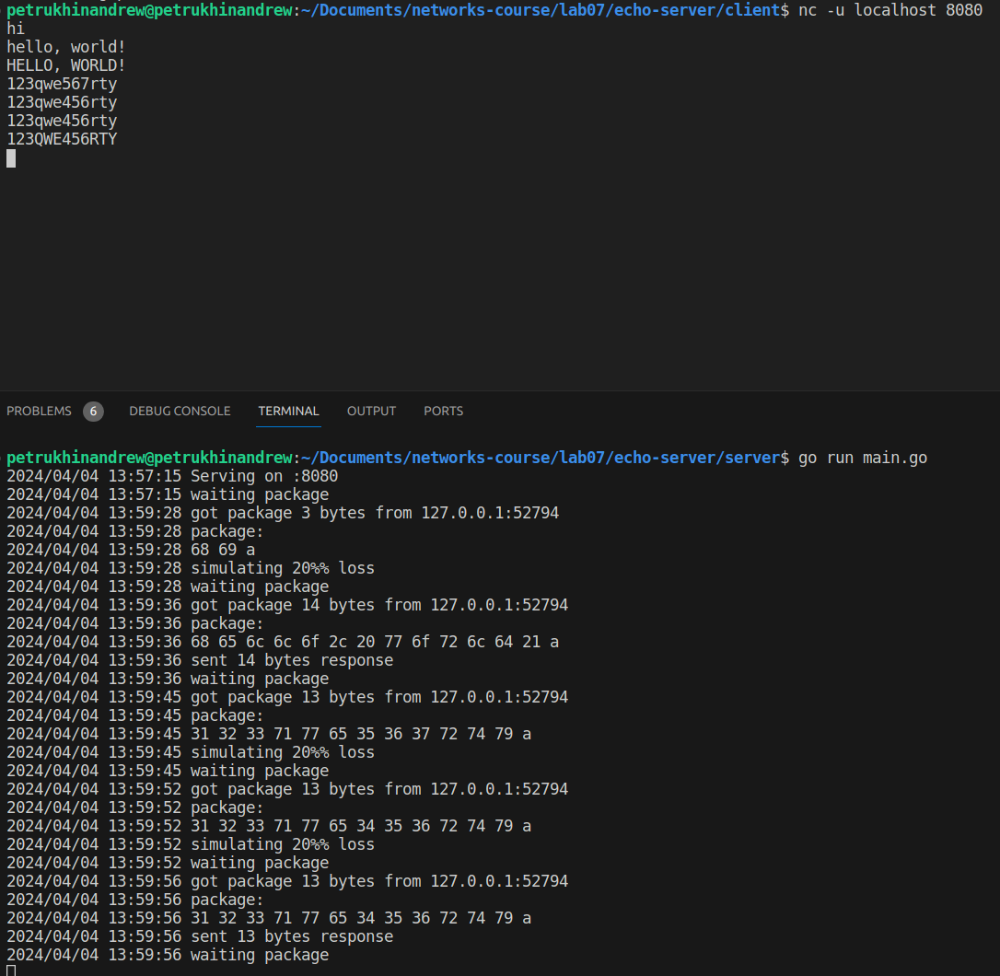
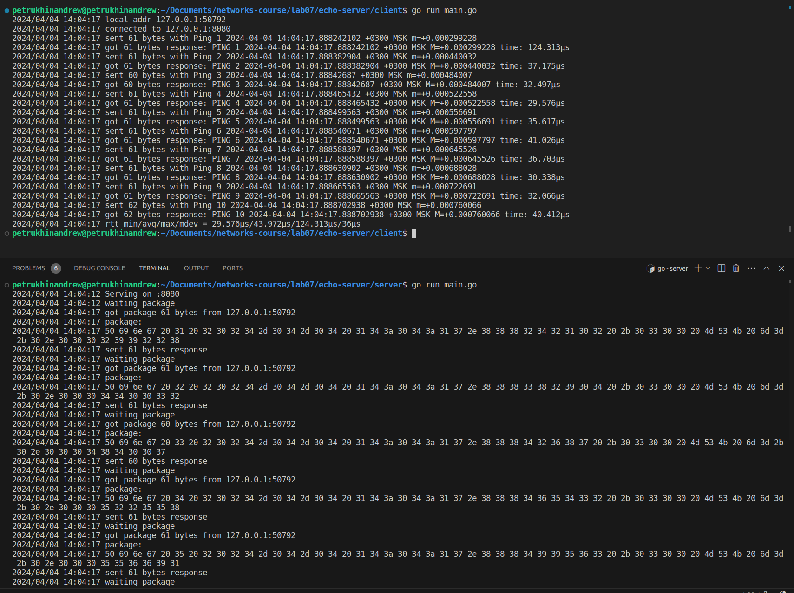
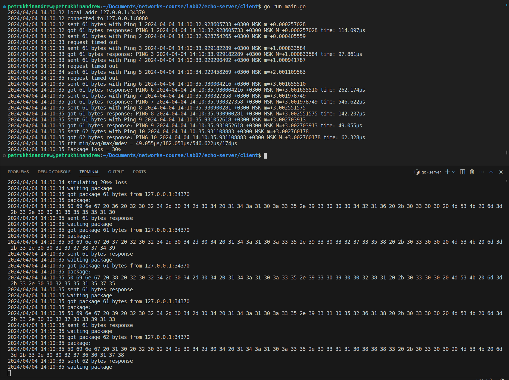
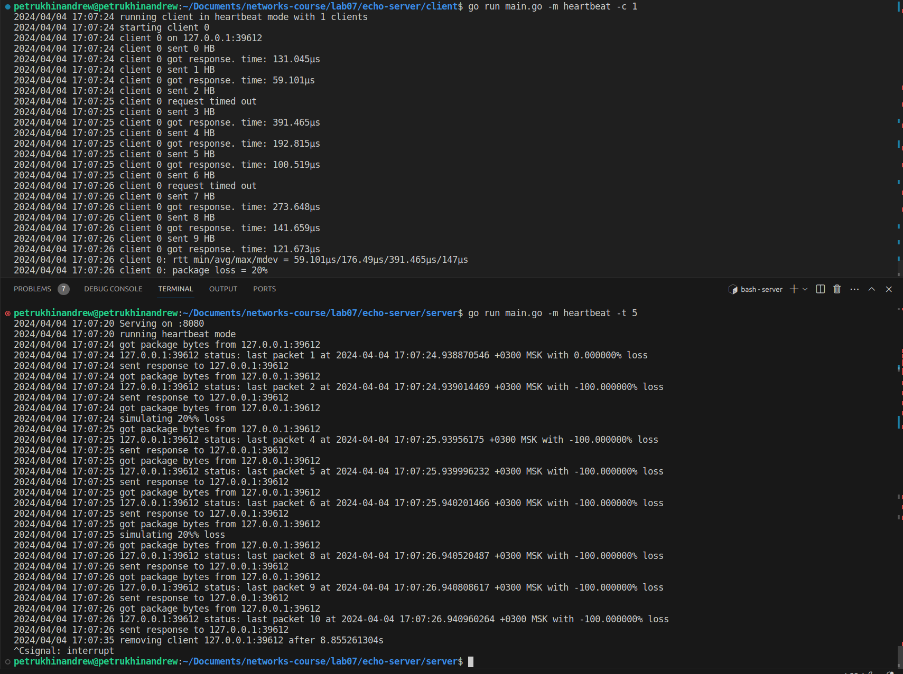

# Практика 7. Транспортный уровень

## Wireshark: TCP (5 баллов)

### Перехват TCP-передачи данных от вашего компьютера удаленному серверу
При ответе на вопросы прикладывайте соответствующие скрины программы Wireshark.

#### Подготовка
1. Откройте веб-браузер и перейдите по ссылке gaia.cs.umass.edu/wireshark-labs/alice.txt.
   Здесь вы найдете копию книги «Алиса в стране чудес» в формате ASCII. Сохраните этот файл 
   на свой компьютер.
2. Перейдите по ссылке: gaia.cs.umass.edu/wireshark-labs/TCP-wireshark-file1.html. Сюда вы
   будете загружать ранее сохраненный файл.
3. Запустите Wireshark и начните перехват пакетов.
4. Теперь загрузите текстовый файл «Алиса в стране чудес» на указанной в п.2 страничке.
5. Остановите захват пакетов в приложении Wireshark. Используйте фильтр пакетов tcp.

#### Вопросы
1. Какой IP-адрес и номер порта TCP использует ваш компьютер (отправитель), передающий
   файл серверу gaia.cs.umass.edu? Для ответа на вопрос, возможно, проще выбрать http-сообщение
   и рассмотреть информацию TCP-пакета, используемого для передачи этого http-сообщения, 
   в окне деталей заголовка пакета.
   - <!-- todo -->
2. Каков IP-адрес у сервера gaia.cs.umass.edu? Каковы номера портов для отправки и приема
   TCP-сегментов этого соединения?
   - <!-- todo -->
   - <!-- todo -->
3. Какой порядковый номер у SYN TCP-сегмента, который используется для установления
   TCP-соединения между компьютером клиента и сервером gaia.cs.umass.edu? Как
   определяется, что это именно SYN-сегмент?
   - <!-- todo -->
   - <!-- todo -->
4. Какой порядковый номер у SYNACK-сегмента, отправленного сервером gaia.cs.umass.edu
   на компьютер клиента в ответ на SYN-сегмент? Какое значение хранится в поле
   подтверждения в SYNACK-сегменте? Как сервер gaia.cs.umass.edu определил это значение?
   Как определяется, что это именно SYNACK-сегмент?
   - <!-- todo -->
   - <!-- todo -->
   - <!-- todo -->
   - <!-- todo -->
5. Какой порядковый номер у TCP-сегмента, содержащего команду POST протокола HTTP?
   (для нахождения команды POST вам потребуется проникнуть внутрь поля содержимого
   пакета в нижней части окна Wireshark, чтобы найти сегмент, в поле DATA которого
   хранится значение POST)
   - <!-- todo -->
6. Рассмотрите TCP-сегмент, содержащий команду POST протокола HTTP, как первый TCP-сегмент 
   соединения. Какие порядковые номера у первых шести сегментов TCP-соединения 
   (включая сегмент, содержащий команду POST протокола HTTP)? Когда был
   отправлен каждый сегмент? Когда был получен ACK-пакет для каждого сегмента?
   Покажите разницу между тем, когда каждый TCP-сегмент был отправлен и когда было
   получено каждое подтверждение, чему равно значение RTT для каждого из 6 сегментов?
   - <!-- todo -->
   - <!-- todo -->
   - <!-- todo -->
   - <!-- todo -->
7. Чему равна пропускная способность (количество байтов, передаваемых в единицу
   времени) для этого TCP-соединения? Объясните, как вы получили это значение.
   - <!-- todo -->
   - <!-- todo -->

### Работа с Time-Sequence-Graph (Stevens) (2 балла)
Time-Sequence-Graph (Stevens) (Временная шкала (Стивенса)) – одна из графических утилит
Wireshark для протокола TCP. Для того, чтобы ее запустить, выберите TCP-сегмент в окне
захваченных полученных пакетов. Затем выберите команду меню Statistics => TCP Stream Graph =>
Time-Sequence-Graph (Stevens) (Статистика => График TCP потока => Временная шкала (Стивенса)).
Каждая точка представляет отправленный TCP-сегмент, на графике изображена зависимость
порядкового номера сегмента от времени, когда он был отправлен.

#### Подготовка (такая же, как в предыдущем задании)
1. Откройте веб-браузер и перейдите по ссылке gaia.cs.umass.edu/wireshark-labs/alice.txt.
   Здесь вы найдете копию книги «Алиса в стране чудес» в формате ASCII. Сохраните этот файл на
   свой компьютер.
2. Перейдите по ссылке: gaia.cs.umass.edu/wireshark-labs/TCP-wireshark-file1.html. Сюда вы
   будете загружать ранее сохраненный файл.
3. Запустите Wireshark и начните перехват пакетов
4. Теперь загрузите текстовый файл «Алиса в стране чудес» на указанной в п.2 страничке
5. Остановите захват пакетов в приложении Wireshark. Используйте фильтр пакетов tcp.

#### Задание
Используйте инструмент построения графиков Time-Sequence-Graph (Stevens), чтобы представить
изменение порядковых номеров на временной шкале для сегментов, отправленных от клиента
серверу gaia.cs.umass.edu. Приложите соответствующий скрин программы Wireshark.

#### Скрин
todo

## Программирование. Эхо-запросы через UDP
Реализуйте сервер для пингования, а также его клиента.

### А. Серверная часть (2 балла)
Сервер находится в бесконечном цикле, ожидая приходящие UDP-пакеты.
Если пакет прибывает, то сервер просто изменяет символы входящего сообщения на заглавные и
отправляет их обратно клиенту. Серверный код должен моделировать 20% потерю пакетов.

#### Демонстрация работы



### Б. Клиентская часть (2 балла)
Клиент должен отправить 10 эхо-запросов серверу. Поскольку UDP является ненадежным с точки
зрения доставки протоколом, то пакет, отправленный от клиента к серверу или наоборот, может
быть потерян в сети. Так как клиент не может бесконечно ждать ответа на запрос, нужно задать
период ожидания ответа (тайм-аут), равный одной секунде – если ответ не будет получен в
течение одной секунды, клиентская программа должна предполагать, что пакет потерян.

Ваша клиентская программа должна:
- отправить эхо-запрос, используя UDP
- распечатать ответное сообщение от сервера (если такое есть)
- вычислить и вывести на печать время оборота (RTT) в секундах для каждого пакета при
ответе сервера
- в противном случае, вывести сообщение «Request timed out»

Формат сообщения:
`Ping номер_последовательности время`
- номер_последовательности начинается с 1 и увеличивается до 10 для каждого
последующего сообщения, отправленного клиентом
- время – это момент времени, когда клиент отправляет сообщение

Сделайте скриншоты, подтверждающие корректную работу вашей программы пингования со стороны клиента.

#### Демонстрация работы

В логах есть поле `got n bytes response ... time=t`, где `t` - RTT


### В. Вывод в формате ping (2 балла)
Версия клиента из предыдущей части (Б) вычисляет время оборота для каждого пакета и выводит
его отдельно. Измените вывод таким образом, чтобы он соответствовал тому, как это делается в
стандартной утилите ping.

Для этого вам нужно будет сообщить минимальное, максимальное и среднее значение RTT в
конце каждого ответа от сервера. Дополнительно вычислите коэффициент потери пакетов (в
процентах).

#### Демонстрация работы



### Г. UDP Heartbeat (4 балла)
UDP Heartbeat (монитор доступности) подобен программе пингования. Он может быть
использован для проверки, работает ли приложение, и вывода сообщения об односторонней
потере пакетов.

Клиент отправляет порядковый номер и текущую временную метку в пакете UDP на сервер,
который слушает «сердцебиение» (т.е. ожидает UDP-пакеты) клиента. После получения пакетов
сервер вычисляет разницу во времени и сообщает о потерях. Если пакеты отсутствуют
определенный период времени, заданный параметром, то делается предположение, что
клиентское приложение остановлено и соответствующее сообщение выводится на консоль
сервера.

Реализуйте UDP Heartbeat (обе части – клиент и сервер), доработав обе ваши части программы
пингования из заданий А и Б.

Обратите внимание, что клиентов у сервера может быть сразу несколько одновременно.
Протестируйте такой сценарий.

#### Демонстрация работы

Формат запроса серверу `HB X TS` где `X` - номер пакета, `TS` время в формате RFC3339Nano



Скриншот для 5 одновременных клиентов не входит, поэтому прикладываю логи

В логах сервера последние 2 клиента удаляются из пула через 9 секунд (хотя должны через 5) из-за "костыльного" использования каналов Go. Как-нибудь я обязательно это починю

Сервер:
```bash
petrukhinandrew@petrukhinandrew:~/Documents/networks-course/lab07/echo-server/server$ go run main.go -m heartbeat -t 5
2024/04/04 17:08:01 Serving on :8080
2024/04/04 17:08:01 running heartbeat mode
2024/04/04 17:08:04 got package bytes from 127.0.0.1:52107
2024/04/04 17:08:04 127.0.0.1:52107 status: last packet 1 at 2024-04-04 17:08:04.907388767 +0300 MSK with 0.000000% loss
2024/04/04 17:08:04 sent response to 127.0.0.1:52107
2024/04/04 17:08:04 got package bytes from 127.0.0.1:52107
2024/04/04 17:08:04 127.0.0.1:52107 status: last packet 2 at 2024-04-04 17:08:04.9075857 +0300 MSK with -100.000000% loss
2024/04/04 17:08:04 sent response to 127.0.0.1:52107
2024/04/04 17:08:04 got package bytes from 127.0.0.1:52107
2024/04/04 17:08:04 127.0.0.1:52107 status: last packet 3 at 2024-04-04 17:08:04.907670917 +0300 MSK with -100.000000% loss
2024/04/04 17:08:04 sent response to 127.0.0.1:52107
2024/04/04 17:08:04 got package bytes from 127.0.0.1:52107
2024/04/04 17:08:04 127.0.0.1:52107 status: last packet 4 at 2024-04-04 17:08:04.907720254 +0300 MSK with -100.000000% loss
2024/04/04 17:08:04 sent response to 127.0.0.1:52107
2024/04/04 17:08:04 got package bytes from 127.0.0.1:52107
2024/04/04 17:08:04 127.0.0.1:52107 status: last packet 5 at 2024-04-04 17:08:04.907761228 +0300 MSK with -100.000000% loss
2024/04/04 17:08:04 sent response to 127.0.0.1:52107
2024/04/04 17:08:04 got package bytes from 127.0.0.1:52107
2024/04/04 17:08:04 127.0.0.1:52107 status: last packet 6 at 2024-04-04 17:08:04.907792195 +0300 MSK with -100.000000% loss
2024/04/04 17:08:04 sent response to 127.0.0.1:52107
2024/04/04 17:08:04 got package bytes from 127.0.0.1:52107
2024/04/04 17:08:04 simulating 20%% loss
2024/04/04 17:08:04 got package bytes from 127.0.0.1:58382
2024/04/04 17:08:04 127.0.0.1:58382 status: last packet 1 at 2024-04-04 17:08:04.918162608 +0300 MSK with 0.000000% loss
2024/04/04 17:08:04 sent response to 127.0.0.1:58382
2024/04/04 17:08:04 got package bytes from 127.0.0.1:58382
2024/04/04 17:08:04 simulating 20%% loss
2024/04/04 17:08:04 got package bytes from 127.0.0.1:42528
2024/04/04 17:08:04 simulating 20%% loss
2024/04/04 17:08:04 got package bytes from 127.0.0.1:43525
2024/04/04 17:08:04 127.0.0.1:43525 status: last packet 1 at 2024-04-04 17:08:04.938979389 +0300 MSK with 0.000000% loss
2024/04/04 17:08:04 sent response to 127.0.0.1:43525
2024/04/04 17:08:04 got package bytes from 127.0.0.1:43525
2024/04/04 17:08:04 127.0.0.1:43525 status: last packet 2 at 2024-04-04 17:08:04.939149682 +0300 MSK with -100.000000% loss
2024/04/04 17:08:04 sent response to 127.0.0.1:43525
2024/04/04 17:08:04 got package bytes from 127.0.0.1:43525
2024/04/04 17:08:04 127.0.0.1:43525 status: last packet 3 at 2024-04-04 17:08:04.93923012 +0300 MSK with -100.000000% loss
2024/04/04 17:08:04 sent response to 127.0.0.1:43525
2024/04/04 17:08:04 got package bytes from 127.0.0.1:43525
2024/04/04 17:08:04 127.0.0.1:43525 status: last packet 4 at 2024-04-04 17:08:04.939322258 +0300 MSK with -100.000000% loss
2024/04/04 17:08:04 sent response to 127.0.0.1:43525
2024/04/04 17:08:04 got package bytes from 127.0.0.1:43525
2024/04/04 17:08:04 127.0.0.1:43525 status: last packet 5 at 2024-04-04 17:08:04.939359118 +0300 MSK with -100.000000% loss
2024/04/04 17:08:04 sent response to 127.0.0.1:43525
2024/04/04 17:08:04 got package bytes from 127.0.0.1:43525
2024/04/04 17:08:04 simulating 20%% loss
2024/04/04 17:08:04 got package bytes from 127.0.0.1:35496
2024/04/04 17:08:04 127.0.0.1:35496 status: last packet 1 at 2024-04-04 17:08:04.949745321 +0300 MSK with 0.000000% loss
2024/04/04 17:08:04 sent response to 127.0.0.1:35496
2024/04/04 17:08:04 got package bytes from 127.0.0.1:35496
2024/04/04 17:08:04 simulating 20%% loss
2024/04/04 17:08:05 got package bytes from 127.0.0.1:52107
2024/04/04 17:08:05 127.0.0.1:52107 status: last packet 8 at 2024-04-04 17:08:05.908454477 +0300 MSK with -100.000000% loss
2024/04/04 17:08:05 sent response to 127.0.0.1:52107
2024/04/04 17:08:05 got package bytes from 127.0.0.1:52107
2024/04/04 17:08:05 127.0.0.1:52107 status: last packet 9 at 2024-04-04 17:08:05.908770755 +0300 MSK with -100.000000% loss
2024/04/04 17:08:05 sent response to 127.0.0.1:52107
2024/04/04 17:08:05 got package bytes from 127.0.0.1:52107
2024/04/04 17:08:05 simulating 20%% loss
2024/04/04 17:08:05 got package bytes from 127.0.0.1:58382
2024/04/04 17:08:05 127.0.0.1:58382 status: last packet 3 at 2024-04-04 17:08:05.919192971 +0300 MSK with -100.000000% loss
2024/04/04 17:08:05 sent response to 127.0.0.1:58382
2024/04/04 17:08:05 got package bytes from 127.0.0.1:58382
2024/04/04 17:08:05 127.0.0.1:58382 status: last packet 4 at 2024-04-04 17:08:05.919460351 +0300 MSK with -100.000000% loss
2024/04/04 17:08:05 sent response to 127.0.0.1:58382
2024/04/04 17:08:05 got package bytes from 127.0.0.1:58382
2024/04/04 17:08:05 127.0.0.1:58382 status: last packet 5 at 2024-04-04 17:08:05.91974336 +0300 MSK with -100.000000% loss
2024/04/04 17:08:05 sent response to 127.0.0.1:58382
2024/04/04 17:08:05 got package bytes from 127.0.0.1:58382
2024/04/04 17:08:05 simulating 20%% loss
2024/04/04 17:08:05 got package bytes from 127.0.0.1:42528
2024/04/04 17:08:05 127.0.0.1:42528 status: last packet 2 at 2024-04-04 17:08:05.929086978 +0300 MSK with 0.000000% loss
2024/04/04 17:08:05 sent response to 127.0.0.1:42528
2024/04/04 17:08:05 got package bytes from 127.0.0.1:42528
2024/04/04 17:08:05 127.0.0.1:42528 status: last packet 3 at 2024-04-04 17:08:05.929262423 +0300 MSK with -100.000000% loss
2024/04/04 17:08:05 sent response to 127.0.0.1:42528
2024/04/04 17:08:05 got package bytes from 127.0.0.1:42528
2024/04/04 17:08:05 127.0.0.1:42528 status: last packet 4 at 2024-04-04 17:08:05.929326587 +0300 MSK with -100.000000% loss
2024/04/04 17:08:05 sent response to 127.0.0.1:42528
2024/04/04 17:08:05 got package bytes from 127.0.0.1:42528
2024/04/04 17:08:05 127.0.0.1:42528 status: last packet 5 at 2024-04-04 17:08:05.929374921 +0300 MSK with -100.000000% loss
2024/04/04 17:08:05 sent response to 127.0.0.1:42528
2024/04/04 17:08:05 got package bytes from 127.0.0.1:42528
2024/04/04 17:08:05 127.0.0.1:42528 status: last packet 6 at 2024-04-04 17:08:05.929429964 +0300 MSK with -100.000000% loss
2024/04/04 17:08:05 sent response to 127.0.0.1:42528
2024/04/04 17:08:05 got package bytes from 127.0.0.1:42528
2024/04/04 17:08:05 127.0.0.1:42528 status: last packet 7 at 2024-04-04 17:08:05.929481227 +0300 MSK with -100.000000% loss
2024/04/04 17:08:05 sent response to 127.0.0.1:42528
2024/04/04 17:08:05 got package bytes from 127.0.0.1:42528
2024/04/04 17:08:05 127.0.0.1:42528 status: last packet 8 at 2024-04-04 17:08:05.929517798 +0300 MSK with -100.000000% loss
2024/04/04 17:08:05 sent response to 127.0.0.1:42528
2024/04/04 17:08:05 got package bytes from 127.0.0.1:42528
2024/04/04 17:08:05 127.0.0.1:42528 status: last packet 9 at 2024-04-04 17:08:05.929559778 +0300 MSK with -100.000000% loss
2024/04/04 17:08:05 sent response to 127.0.0.1:42528
2024/04/04 17:08:05 got package bytes from 127.0.0.1:42528
2024/04/04 17:08:05 127.0.0.1:42528 status: last packet 10 at 2024-04-04 17:08:05.92959667 +0300 MSK with -100.000000% loss
2024/04/04 17:08:05 sent response to 127.0.0.1:42528
2024/04/04 17:08:05 got package bytes from 127.0.0.1:43525
2024/04/04 17:08:05 127.0.0.1:43525 status: last packet 7 at 2024-04-04 17:08:05.939859725 +0300 MSK with -100.000000% loss
2024/04/04 17:08:05 sent response to 127.0.0.1:43525
2024/04/04 17:08:05 got package bytes from 127.0.0.1:43525
2024/04/04 17:08:05 127.0.0.1:43525 status: last packet 8 at 2024-04-04 17:08:05.939984288 +0300 MSK with -100.000000% loss
2024/04/04 17:08:05 sent response to 127.0.0.1:43525
2024/04/04 17:08:05 got package bytes from 127.0.0.1:43525
2024/04/04 17:08:05 127.0.0.1:43525 status: last packet 9 at 2024-04-04 17:08:05.940039755 +0300 MSK with -100.000000% loss
2024/04/04 17:08:05 sent response to 127.0.0.1:43525
2024/04/04 17:08:05 got package bytes from 127.0.0.1:43525
2024/04/04 17:08:05 127.0.0.1:43525 status: last packet 10 at 2024-04-04 17:08:05.94012852 +0300 MSK with -100.000000% loss
2024/04/04 17:08:05 sent response to 127.0.0.1:43525
2024/04/04 17:08:05 got package bytes from 127.0.0.1:35496
2024/04/04 17:08:05 127.0.0.1:35496 status: last packet 3 at 2024-04-04 17:08:05.951181009 +0300 MSK with -100.000000% loss
2024/04/04 17:08:05 sent response to 127.0.0.1:35496
2024/04/04 17:08:05 got package bytes from 127.0.0.1:35496
2024/04/04 17:08:05 127.0.0.1:35496 status: last packet 4 at 2024-04-04 17:08:05.95153694 +0300 MSK with -100.000000% loss
2024/04/04 17:08:05 sent response to 127.0.0.1:35496
2024/04/04 17:08:05 got package bytes from 127.0.0.1:35496
2024/04/04 17:08:05 127.0.0.1:35496 status: last packet 5 at 2024-04-04 17:08:05.951772831 +0300 MSK with -100.000000% loss
2024/04/04 17:08:05 sent response to 127.0.0.1:35496
2024/04/04 17:08:05 got package bytes from 127.0.0.1:35496
2024/04/04 17:08:05 127.0.0.1:35496 status: last packet 6 at 2024-04-04 17:08:05.952295437 +0300 MSK with -100.000000% loss
2024/04/04 17:08:05 sent response to 127.0.0.1:35496
2024/04/04 17:08:05 got package bytes from 127.0.0.1:35496
2024/04/04 17:08:05 127.0.0.1:35496 status: last packet 7 at 2024-04-04 17:08:05.952445313 +0300 MSK with -100.000000% loss
2024/04/04 17:08:05 sent response to 127.0.0.1:35496
2024/04/04 17:08:05 got package bytes from 127.0.0.1:35496
2024/04/04 17:08:05 simulating 20%% loss
2024/04/04 17:08:06 got package bytes from 127.0.0.1:58382
2024/04/04 17:08:06 127.0.0.1:58382 status: last packet 7 at 2024-04-04 17:08:06.920813598 +0300 MSK with -100.000000% loss
2024/04/04 17:08:06 sent response to 127.0.0.1:58382
2024/04/04 17:08:06 got package bytes from 127.0.0.1:58382
2024/04/04 17:08:06 127.0.0.1:58382 status: last packet 8 at 2024-04-04 17:08:06.921107152 +0300 MSK with -100.000000% loss
2024/04/04 17:08:06 sent response to 127.0.0.1:58382
2024/04/04 17:08:06 got package bytes from 127.0.0.1:58382
2024/04/04 17:08:06 127.0.0.1:58382 status: last packet 9 at 2024-04-04 17:08:06.921332439 +0300 MSK with -100.000000% loss
2024/04/04 17:08:06 sent response to 127.0.0.1:58382
2024/04/04 17:08:06 got package bytes from 127.0.0.1:58382
2024/04/04 17:08:06 simulating 20%% loss
2024/04/04 17:08:06 got package bytes from 127.0.0.1:35496
2024/04/04 17:08:06 127.0.0.1:35496 status: last packet 9 at 2024-04-04 17:08:06.952832074 +0300 MSK with -100.000000% loss
2024/04/04 17:08:06 sent response to 127.0.0.1:35496
2024/04/04 17:08:06 got package bytes from 127.0.0.1:35496
2024/04/04 17:08:06 simulating 20%% loss
2024/04/04 17:08:11 removing client 127.0.0.1:42528 after 5.970588189s
2024/04/04 17:08:11 removing client 127.0.0.1:52107 after 5.991479839s
2024/04/04 17:08:11 removing client 127.0.0.1:43525 after 5.960131066s
2024/04/04 17:08:16 removing client 127.0.0.1:58382 after 9.976215334s
2024/04/04 17:08:16 removing client 127.0.0.1:35496 after 9.944732428s
```

Клиент:
```bash
petrukhinandrew@petrukhinandrew:~/Documents/networks-course/lab07/echo-server/client$ go run main.go -m heartbeat -c 5
2024/04/04 17:08:04 running client in heartbeat mode with 5 clients
2024/04/04 17:08:04 starting client 0
2024/04/04 17:08:04 client 0 on 127.0.0.1:52107
2024/04/04 17:08:04 client 0 sent 0 HB
2024/04/04 17:08:04 client 0 got response. time: 186.321µs
2024/04/04 17:08:04 client 0 sent 1 HB
2024/04/04 17:08:04 client 0 got response. time: 77.283µs
2024/04/04 17:08:04 client 0 sent 2 HB
2024/04/04 17:08:04 client 0 got response. time: 45.711µs
2024/04/04 17:08:04 client 0 sent 3 HB
2024/04/04 17:08:04 client 0 got response. time: 37.145µs
2024/04/04 17:08:04 client 0 sent 4 HB
2024/04/04 17:08:04 client 0 got response. time: 27.823µs
2024/04/04 17:08:04 client 0 sent 5 HB
2024/04/04 17:08:04 client 0 got response. time: 34.042µs
2024/04/04 17:08:04 client 0 sent 6 HB
2024/04/04 17:08:04 starting client 1
2024/04/04 17:08:04 client 1 on 127.0.0.1:58382
2024/04/04 17:08:04 client 1 sent 0 HB
2024/04/04 17:08:04 client 1 got response. time: 104.047µs
2024/04/04 17:08:04 client 1 sent 1 HB
2024/04/04 17:08:04 starting client 2
2024/04/04 17:08:04 client 2 on 127.0.0.1:42528
2024/04/04 17:08:04 client 2 sent 0 HB
2024/04/04 17:08:04 starting client 3
2024/04/04 17:08:04 client 3 on 127.0.0.1:43525
2024/04/04 17:08:04 client 3 sent 0 HB
2024/04/04 17:08:04 client 3 got response. time: 151.632µs
2024/04/04 17:08:04 client 3 sent 1 HB
2024/04/04 17:08:04 client 3 got response. time: 72.291µs
2024/04/04 17:08:04 client 3 sent 2 HB
2024/04/04 17:08:04 client 3 got response. time: 88.155µs
2024/04/04 17:08:04 client 3 sent 3 HB
2024/04/04 17:08:04 client 3 got response. time: 32.61µs
2024/04/04 17:08:04 client 3 sent 4 HB
2024/04/04 17:08:04 client 3 got response. time: 62.108µs
2024/04/04 17:08:04 client 3 sent 5 HB
2024/04/04 17:08:04 starting client 4
2024/04/04 17:08:04 client 4 on 127.0.0.1:35496
2024/04/04 17:08:04 client 4 sent 0 HB
2024/04/04 17:08:04 client 4 got response. time: 129.308µs
2024/04/04 17:08:04 client 4 sent 1 HB
2024/04/04 17:08:05 client 0 request timed out
2024/04/04 17:08:05 client 0 sent 7 HB
2024/04/04 17:08:05 client 0 got response. time: 276.453µs
2024/04/04 17:08:05 client 0 sent 8 HB
2024/04/04 17:08:05 client 0 got response. time: 141.14µs
2024/04/04 17:08:05 client 0 sent 9 HB
2024/04/04 17:08:05 client 1 request timed out
2024/04/04 17:08:05 client 1 sent 2 HB
2024/04/04 17:08:05 client 1 got response. time: 246.166µs
2024/04/04 17:08:05 client 1 sent 3 HB
2024/04/04 17:08:05 client 1 got response. time: 263.277µs
2024/04/04 17:08:05 client 1 sent 4 HB
2024/04/04 17:08:05 client 1 got response. time: 108.371µs
2024/04/04 17:08:05 client 1 sent 5 HB
2024/04/04 17:08:05 client 2 request timed out
2024/04/04 17:08:05 client 2 sent 1 HB
2024/04/04 17:08:05 client 2 got response. time: 153.269µs
2024/04/04 17:08:05 client 2 sent 2 HB
2024/04/04 17:08:05 client 2 got response. time: 58.267µs
2024/04/04 17:08:05 client 2 sent 3 HB
2024/04/04 17:08:05 client 2 got response. time: 43.863µs
2024/04/04 17:08:05 client 2 sent 4 HB
2024/04/04 17:08:05 client 2 got response. time: 50.368µs
2024/04/04 17:08:05 client 2 sent 5 HB
2024/04/04 17:08:05 client 2 got response. time: 48.013µs
2024/04/04 17:08:05 client 2 sent 6 HB
2024/04/04 17:08:05 client 2 got response. time: 32.825µs
2024/04/04 17:08:05 client 2 sent 7 HB
2024/04/04 17:08:05 client 2 got response. time: 38.618µs
2024/04/04 17:08:05 client 2 sent 8 HB
2024/04/04 17:08:05 client 2 got response. time: 32.883µs
2024/04/04 17:08:05 client 2 sent 9 HB
2024/04/04 17:08:05 client 2 got response. time: 42.157µs
2024/04/04 17:08:05 client 2: rtt min/avg/max/mdev = 32.825µs/55.584µs/153.269µs/47µs
2024/04/04 17:08:05 client 2: package loss = 10%
2024/04/04 17:08:05 client 3 request timed out
2024/04/04 17:08:05 client 3 sent 6 HB
2024/04/04 17:08:05 client 3 got response. time: 117.789µs
2024/04/04 17:08:05 client 3 sent 7 HB
2024/04/04 17:08:05 client 3 got response. time: 51.591µs
2024/04/04 17:08:05 client 3 sent 8 HB
2024/04/04 17:08:05 client 3 got response. time: 83.507µs
2024/04/04 17:08:05 client 3 sent 9 HB
2024/04/04 17:08:05 client 3 got response. time: 61.482µs
2024/04/04 17:08:05 client 3: rtt min/avg/max/mdev = 32.61µs/80.129µs/151.632µs/62µs
2024/04/04 17:08:05 client 3: package loss = 10%
2024/04/04 17:08:05 client 4 request timed out
2024/04/04 17:08:05 client 4 sent 2 HB
2024/04/04 17:08:05 client 4 got response. time: 193.116µs
2024/04/04 17:08:05 client 4 sent 3 HB
2024/04/04 17:08:05 client 4 got response. time: 162.526µs
2024/04/04 17:08:05 client 4 sent 4 HB
2024/04/04 17:08:05 client 4 got response. time: 499.328µs
2024/04/04 17:08:05 client 4 sent 5 HB
2024/04/04 17:08:05 client 4 got response. time: 128.615µs
2024/04/04 17:08:05 client 4 sent 6 HB
2024/04/04 17:08:05 client 4 got response. time: 83.162µs
2024/04/04 17:08:05 client 4 sent 7 HB
2024/04/04 17:08:06 client 0 request timed out
2024/04/04 17:08:06 client 0: rtt min/avg/max/mdev = 27.823µs/103.239µs/276.453µs/95µs
2024/04/04 17:08:06 client 0: package loss = 20%
2024/04/04 17:08:06 client 1 request timed out
2024/04/04 17:08:06 client 1 sent 6 HB
2024/04/04 17:08:06 client 1 got response. time: 255.329µs
2024/04/04 17:08:06 client 1 sent 7 HB
2024/04/04 17:08:06 client 1 got response. time: 209.866µs
2024/04/04 17:08:06 client 1 sent 8 HB
2024/04/04 17:08:06 client 1 got response. time: 130.585µs
2024/04/04 17:08:06 client 1 sent 9 HB
2024/04/04 17:08:06 client 4 request timed out
2024/04/04 17:08:06 client 4 sent 8 HB
2024/04/04 17:08:06 client 4 got response. time: 189.42µs
2024/04/04 17:08:06 client 4 sent 9 HB
2024/04/04 17:08:07 client 1 request timed out
2024/04/04 17:08:07 client 1: rtt min/avg/max/mdev = 104.047µs/188.234µs/263.277µs/150µs
2024/04/04 17:08:07 client 1: package loss = 30%
2024/04/04 17:08:07 client 4 request timed out
2024/04/04 17:08:07 client 4: rtt min/avg/max/mdev = 83.162µs/197.925µs/499.328µs/172µs
2024/04/04 17:08:07 client 4: package loss = 30%
```

## Задачи

### Задача 1 (3 балла)
Рассмотрим протоколы GBN и SR. Предположим, пространство порядковых номеров имеет размер $k$.

Постановка задачи: найти наибольшее допустимое окно передачи, которое позволит обойти
возникновение проблемы, показанной на рисунке для каждого из этих протоколов?


Описание проблемы:
Отсутствие синхронизации между окнами отправителя и получателя имеет важные последствия,
когда мы сталкиваемся с ограниченностью диапазона порядковых номеров. Рассмотрим, что
могло бы произойти, например, если у нас есть четыре пакета с порядковыми номерами 0, 1, 2, 3,
а размер окна равен трем. Предположим, пакеты с 0 по 2 переданы отправителем, корректно
получены и подтверждены получателем. В этот момент окно получателя заполняется четвертым,
пятым и шестым пакетами, которые имеют порядковые номера 3, 0 и 1, соответственно. Теперь
рассмотрим два сценария.

В первом сценарии (на рисунке сверху) квитанции ACK на первые три пакета доставлены верно.
Таким образом, отправитель сдвигает окно вперед и отправляет четвертый, пятый и шестой
пакеты с порядковыми номерами 3, 0 и 1 соответственно.
Пакет с порядковым номером 3 потерян, но пакет с порядковым номером 0, **содержащий новые данные**, 
получен.

Во втором случае (рисунок снизу) ACK пакеты для первых трех пакетов данных потеряны, и
отправитель пересылает эти пакеты. Таким образом, получатель далее получает пакет с
порядковым номером 0 — **копию первого отправленного**.
Теперь рассмотрим ту же ситуацию с точки зрения принимающей стороны. Действия,
выполняемые передающей стороной, скрыты от нее; принимающая сторона способна лишь
следить за последовательностями получаемых пакетов и генерируемых квитанций. Подобная
ограниченность приводит к тому, что обе описанные выше ситуации воспринимаются
принимающей стороной как одинаковые. Она не может отличить исходную передачу пакета от
повторной.

#### Решение
todo

### Задача 2 (2 балла)
Представим себе следующую ситуацию: один хост расположен в Санкт-Петербурге, а другой — во
Владивостоке. Пусть время оборота RTT между этими двумя хостами приблизительно равно $30$ мс.
Предположим далее, что хосты соединены каналом со скоростью передачи $R$, равной $1$ Гбит/с
($10^9$ бит/с).

Предположим, что размер передаваемого пакета составляет $1500$ байт, включая поля
заголовка и данные.

Насколько большим должен быть размер окна $n$, чтобы использование канала составило
более $98$ процентов?

#### Решение
todo
