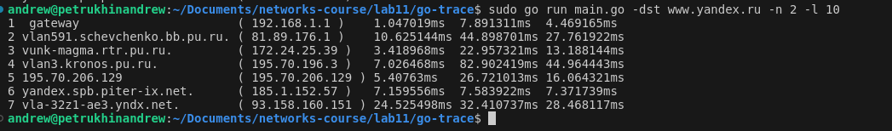
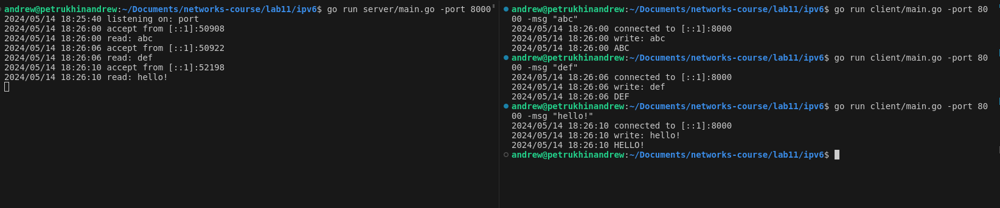

# Трассировка маршрута с использованием ICMP (8 баллов)

Решение в `go-trace`: `-dst` - адрес (`www.yandex.ru` по умолчанию), `-n` - число пакетов с одинаковым значением TTL (3 по умолчанию), `-l` - максимальное значение TTL (20 по умолчанию)

# IPv6

Решение в `ipv6/server` и `ipv6/client` соответственно. Флаг сервера `-port` - порт, на котором он будет запущен. Флаги клиента `-port` - флаг сервера и `-msg` - сообщение серверу

