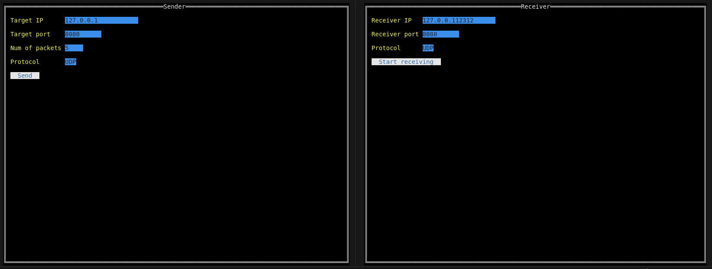
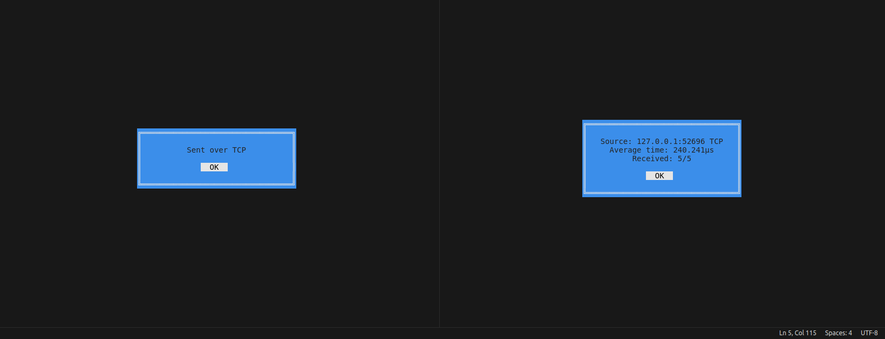
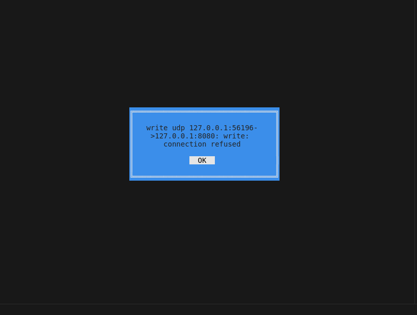
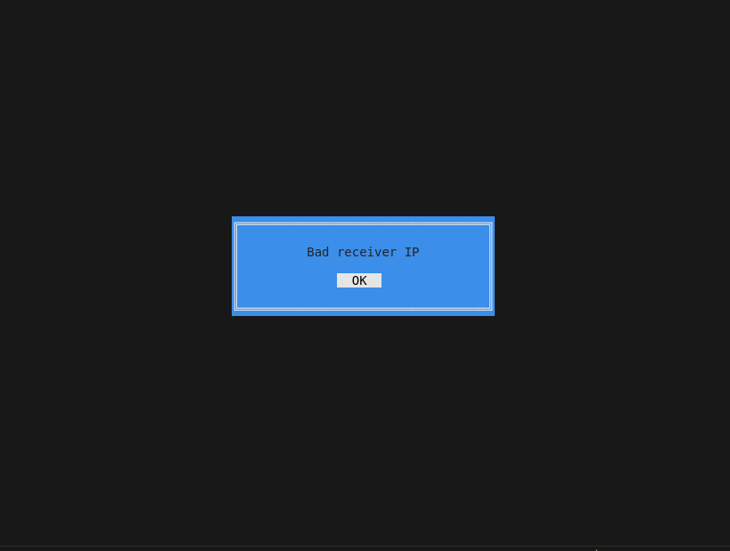

## Скорость передачи

Пакет: id(1) | max_id(1) | timestamp(15) 

Для запуска в `speedtest/sender` и `speedtest/receiver` `go run main.go`. Можно использовать мышку или `Tab/Enter`

Программа не показывает, если происходит ожидание пакетов (я честно не смог разобраться, как работает перерисовка), но если происходит ошибка или все пакеты приняты, отобразится сообщение





Пример, когда серер не ожидает пакетов:



Пример для некорректного IP:



## RIP

Решение в `rip/`, `go run main.go [-c config.json]` для запуска, флагом можно задать путь к конфигу (в примере указан конфиг по умолчанию)

Пример вывода для заданного конфига
```
Simulation on router 192.168.0.1 at step 0
Source        Destination   Next Hop      Distance
192.168.0.1   192.168.0.1   192.168.0.1   0
Simulation on router 192.168.0.2 at step 0
Source        Destination   Next Hop      Distance
192.168.0.2   192.168.0.2   192.168.0.2   0
Simulation on router 192.168.0.2 at step 1
Source        Destination   Next Hop      Distance
192.168.0.2   192.168.0.2   192.168.0.2   0
192.168.0.2   192.168.0.1   192.168.0.1   1
Simulation on router 192.168.0.1 at step 1
Source        Destination   Next Hop      Distance
192.168.0.1   192.168.0.1   192.168.0.1   0
192.168.0.1   192.168.0.2   192.168.0.2   1
Simulation on router 192.168.0.1 at step 2
Source        Destination   Next Hop      Distance
192.168.0.1   192.168.0.1   192.168.0.1   0
192.168.0.1   192.168.0.2   192.168.0.2   1
Simulation on router 192.168.0.2 at step 2
Source        Destination   Next Hop      Distance
192.168.0.2   192.168.0.2   192.168.0.2   0
192.168.0.2   192.168.0.1   192.168.0.1   1
Simulation on router 192.168.0.3 at step 0
Source        Destination   Next Hop      Distance
192.168.0.3   192.168.0.3   192.168.0.3   0
Simulation on router 192.168.0.3 at step 1
Source        Destination   Next Hop      Distance
192.168.0.3   192.168.0.2   192.168.0.2   1
192.168.0.3   192.168.0.3   192.168.0.3   0
Simulation on router 192.168.0.3 at step 2
Source        Destination   Next Hop      Distance
192.168.0.3   192.168.0.3   192.168.0.3   0
192.168.0.3   192.168.0.2   192.168.0.2   1
192.168.0.3   192.168.0.1   192.168.0.2   2
Simulation on router 192.168.0.2 at step 3
Source        Destination   Next Hop      Distance
192.168.0.2   192.168.0.2   192.168.0.2   0
192.168.0.2   192.168.0.1   192.168.0.1   1
192.168.0.2   192.168.0.3   192.168.0.3   1
Simulation on router 192.168.0.2 at step 4
Source        Destination   Next Hop      Distance
192.168.0.2   192.168.0.2   192.168.0.2   0
192.168.0.2   192.168.0.1   192.168.0.1   1
192.168.0.2   192.168.0.3   192.168.0.3   1
Simulation on router 192.168.0.2 at step 5
Source        Destination   Next Hop      Distance
192.168.0.2   192.168.0.2   192.168.0.2   0
192.168.0.2   192.168.0.1   192.168.0.1   1
192.168.0.2   192.168.0.3   192.168.0.3   1
Simulation on router 192.168.0.3 at step 3
Source        Destination   Next Hop      Distance
192.168.0.3   192.168.0.2   192.168.0.2   1
192.168.0.3   192.168.0.1   192.168.0.2   2
192.168.0.3   192.168.0.3   192.168.0.3   0
Simulation on router 192.168.0.1 at step 3
Source        Destination   Next Hop      Distance
192.168.0.1   192.168.0.1   192.168.0.1   0
192.168.0.1   192.168.0.2   192.168.0.2   1
192.168.0.1   192.168.0.3   192.168.0.2   2
Simulation on router 192.168.0.2 at step 6
Source        Destination   Next Hop      Distance
192.168.0.2   192.168.0.2   192.168.0.2   0
192.168.0.2   192.168.0.1   192.168.0.1   1
192.168.0.2   192.168.0.3   192.168.0.3   1
Simulation on router 192.168.0.4 at step 0
Source        Destination   Next Hop      Distance
192.168.0.4   192.168.0.4   192.168.0.4   0
Simulation on router 192.168.0.4 at step 1
Source        Destination   Next Hop      Distance
192.168.0.4   192.168.0.4   192.168.0.4   0
192.168.0.4   192.168.0.3   192.168.0.3   1
Simulation on router 192.168.0.4 at step 2
Source        Destination   Next Hop      Distance
192.168.0.4   192.168.0.4   192.168.0.4   0
192.168.0.4   192.168.0.3   192.168.0.3   1
192.168.0.4   192.168.0.2   192.168.0.3   2
Simulation on router 192.168.0.4 at step 3
Source        Destination   Next Hop      Distance
192.168.0.4   192.168.0.4   192.168.0.4   0
192.168.0.4   192.168.0.3   192.168.0.3   1
192.168.0.4   192.168.0.2   192.168.0.3   2
192.168.0.4   192.168.0.1   192.168.0.3   3
Simulation on router 192.168.0.3 at step 4
Source        Destination   Next Hop      Distance
192.168.0.3   192.168.0.3   192.168.0.3   0
192.168.0.3   192.168.0.2   192.168.0.2   1
192.168.0.3   192.168.0.1   192.168.0.2   2
192.168.0.3   192.168.0.4   192.168.0.4   1
Simulation on router 192.168.0.3 at step 5
Source        Destination   Next Hop      Distance
192.168.0.3   192.168.0.3   192.168.0.3   0
192.168.0.3   192.168.0.2   192.168.0.2   1
192.168.0.3   192.168.0.1   192.168.0.2   2
192.168.0.3   192.168.0.4   192.168.0.4   1
Simulation on router 192.168.0.3 at step 6
Source        Destination   Next Hop      Distance
192.168.0.3   192.168.0.3   192.168.0.3   0
192.168.0.3   192.168.0.2   192.168.0.2   1
192.168.0.3   192.168.0.1   192.168.0.2   2
192.168.0.3   192.168.0.4   192.168.0.4   1
Simulation on router 192.168.0.3 at step 7
Source        Destination   Next Hop      Distance
192.168.0.3   192.168.0.3   192.168.0.3   0
192.168.0.3   192.168.0.2   192.168.0.2   1
192.168.0.3   192.168.0.1   192.168.0.2   2
192.168.0.3   192.168.0.4   192.168.0.4   1
Simulation on router 192.168.0.4 at step 4
Source        Destination   Next Hop      Distance
192.168.0.4   192.168.0.4   192.168.0.4   0
192.168.0.4   192.168.0.3   192.168.0.3   1
192.168.0.4   192.168.0.2   192.168.0.3   2
192.168.0.4   192.168.0.1   192.168.0.3   3
Simulation on router 192.168.0.2 at step 7
Source        Destination   Next Hop      Distance
192.168.0.2   192.168.0.2   192.168.0.2   0
192.168.0.2   192.168.0.1   192.168.0.1   1
192.168.0.2   192.168.0.3   192.168.0.3   1
192.168.0.2   192.168.0.4   192.168.0.3   2
Simulation on router 192.168.0.3 at step 8
Source        Destination   Next Hop      Distance
192.168.0.3   192.168.0.3   192.168.0.3   0
192.168.0.3   192.168.0.2   192.168.0.2   1
192.168.0.3   192.168.0.1   192.168.0.2   2
192.168.0.3   192.168.0.4   192.168.0.4   1
Simulation on router 192.168.0.1 at step 4
Source        Destination   Next Hop      Distance
192.168.0.1   192.168.0.1   192.168.0.1   0
192.168.0.1   192.168.0.3   192.168.0.2   2
192.168.0.1   192.168.0.4   192.168.0.2   3
192.168.0.1   192.168.0.2   192.168.0.2   1
Simulation on router 192.168.0.2 at step 8
Source        Destination   Next Hop      Distance
192.168.0.2   192.168.0.4   192.168.0.3   2
192.168.0.2   192.168.0.2   192.168.0.2   0
192.168.0.2   192.168.0.1   192.168.0.1   1
192.168.0.2   192.168.0.3   192.168.0.3   1
Final state on router 192.168.0.2
Source        Destination   Next Hop      Distance
192.168.0.2   192.168.0.2   192.168.0.2   0
192.168.0.2   192.168.0.1   192.168.0.1   1
192.168.0.2   192.168.0.3   192.168.0.3   1
192.168.0.2   192.168.0.4   192.168.0.3   2
Final state on router 192.168.0.3
Source        Destination   Next Hop      Distance
192.168.0.3   192.168.0.3   192.168.0.3   0
192.168.0.3   192.168.0.2   192.168.0.2   1
192.168.0.3   192.168.0.1   192.168.0.2   2
192.168.0.3   192.168.0.4   192.168.0.4   1
Final state on router 192.168.0.4
Source        Destination   Next Hop      Distance
192.168.0.4   192.168.0.4   192.168.0.4   0
192.168.0.4   192.168.0.3   192.168.0.3   1
192.168.0.4   192.168.0.2   192.168.0.3   2
192.168.0.4   192.168.0.1   192.168.0.3   3
Final state on router 192.168.0.1
Source        Destination   Next Hop      Distance
192.168.0.1   192.168.0.1   192.168.0.1   0
192.168.0.1   192.168.0.3   192.168.0.2   2
192.168.0.1   192.168.0.4   192.168.0.2   3
192.168.0.1   192.168.0.2   192.168.0.2   1
```